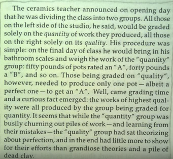

# Job Search Guide

**Purpose**: This repository is a guide for the first 12 weeks of your job search. It provides recommendations on how you should think about your job search, how you should organize your time, and what you should be working on and studying. 

## Starting With Your Goals
"When would you like to have a job offer by?" 

Think about that question for a moment. Is it in half of a year? One month? Three months? Most job seekers usually say that they'd like a job in 3 months, but fail to understand the amount of work that is required to turn that goal into fruition within that short time frame. 

3 months. That's approximately 12 weeks. That means that in 1 month, you should be 1/3rd of the way to your goal. That means that in 1 month, you should have at least been on several phone screens, with a good portion of those phone screens translating into next steps. That means in 8 weeks, you should probably have multiple onsites lined up so that at least one of them can translate into an offer. 

In other words, you should absolutely be setting intermediate goals on a daily and weekly basis, and if you're not meeting those goals, then you should be consistently re-evaluating how you can make your job search more effective and efficient. 

Here's the recommended goals for the first 12 weeks of your job search that you should measure yourself by:
1. 10 phone screens
2. 60% conversion rate on those 10 phone screens into next steps.
3. 2 onsites.
4. 1 offer 

## Mindset
At this point, you're likely feeling burnt out. You just went through a grueling 13 weeks of a bootcamp that was designed to push you to the limits of what you're capable of learning in a short amount of time. 

At this point, what you **don't** want to do is to completely unwind and relax. Now, absolutely take a weekend to rejevuenate and rest up. But once you start the job search, you should strive to find that sweet spot of working the hardest you possibly can **at a sustainable pace**.

That means that you should definitely take care of yourself: get enough rest, eat well, exercise often, do things that you enjoy. At the same time, that should be balanced with the same level of hard work that you had during the bootcamp. **The job search is the hardest part of this entire experience. It will require your maximum effort.**

Consistency is also highly important, which is why it's important to find a sustainable pace. You want to, at all cost, avoid "0 days". In other words, never want to have a day where you accomplish nothing. Every day of the job search is important. If your goal is to find a job in 12 weeks, then, assuming that you work 6 out of the 7 days of the week, you have 72 days to get yourself a job offer! Ever day and every hour counts and is important!

["Make something and break some pots along the way"](https://www.youtube.com/watch?v=YJZCUhxNCv8)

"Knowledge and productivity are like compound interest. Given two people of approximately the same ability and one person who works 10% more than the other, the latter will more than twice outproduce the former. The more you know, the more you learn; the more you learn, the more you can do; the more you can do, the more the opportunity - it is very much like compound interest. I don’t want to give you a rate, but it is a very high rate. Given two people with exactly the same ability, the one person who manages day in and day out to get in one more hour of thinking will be tremendously more productive over a lifetime. I took Bode’s remark to heart; I spent a good deal more of my time for some years trying to work a bit harder and I found, in fact, I could get more work done."

## List of Resources

* https://github.com/jwasham/coding-interview-university
* https://www.topcoder.com/community/data-science/data-science-tutorials/
* https://medium.com/always-be-coding/abc-always-be-coding-d5f8051afce2